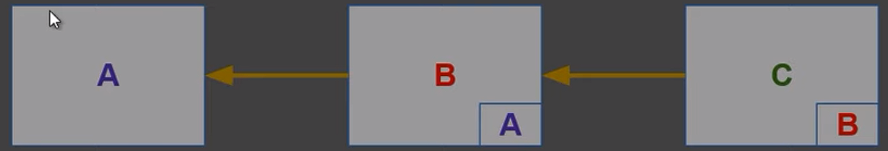

# FUNDAMENTOS DA PROGRAMAÇÃO ORIENTADA A OBJETOS (POO)

### **MENU DE CONTEÚDOS**
- [**O QUE É A PROGRAMAÇÃO DE ORIENTAÇÃO A OBJETOS**](#o-que-é-a-programação-de-orientação-a-objetos)
- [**VANTAGENS DA ORIENTAÇÃO A OBJETOS**](#vantagens-da-orientação-a-objetos)
- [**CONCEITO DE ABSTRAÇÃO**](#conceito-de-abstração)
- [**CONCEITO DE MENSAGEM**](#conceito-de-mensagem)
- [**CONCEITO DE CLASSE**](#conceito-de-objetos)
- [**CONCEITO DE OBJETOS**](#conceito-de-objetos)
- [**EXEMPLIFICANDO OS CONCEITOS DE CLASSE E OBJETOS**](#exemplificando-os-conceitos-de-classe-e-objetos)
- [**EXEMPLO DE CÓDIGO PARA CLASS**](#exemplo-de-código-para-class)
- [**CONCEITO DE HERANÇA**](#conceito-de-herança)
- [**CONCEITO DE ENCAPSULAMENTO**](#conceito-de-encapsulamento)
- [**CONCEITO DE POLIMORFISMO**](#conceito-de-polimorfismo)
- [**DATA CLASS**](#data-class)
- [**ENUM CLASS**](#enum-class)

---

## - **O QUE É A PROGRAMAÇÃO DE ORIENTAÇÃO A OBJETOS**

A POO é um paradigma de programação que se propõe a abordar o design de um sistema em termos de entidades, os objetos, e relacionamentos entre essas entidades. 

Imagine que estamos desenhando um sistema de gerenciamento de funcionários para uma empresa: o funcionário, sob esta abordagem, será uma entidade, e ele deve pertencer a um departamento. 

O departamento também será uma entidade, um objeto. Um departamento pode ter um ou mais funcionários. Logo, estabelecemos um relacionamento entre funcionário e departamento. 

Este funcionário pode ser terceirizado ou direto. Com isso, estabelecemos uma generalização, o funcionário, e sua especialização, ou seja, o funcionário terceirizado, por exemplo.

> Fonte: [Kenzie Academy](https://kenzie.com.br/blog/programacao-orientada-a-objetos/)

1. O POO é um método de programação (paradigma) que usa tipos de dados personalizados.
2. Em vez de operar apenas com tipos de dados primitivos (string, int, boolean, etc), podemos construir novos tipos de dados (chamadas de **classes**).
3. Baseia-se fundamentalmente no conceito de **OBJETOS**.

<BR>

## - **VANTAGENS DA ORIENTAÇÃO A OBJETOS**
1. Fornece uma **estrutura modular** para a construção de programas;
2. O software se torna mais fácil de manter;
3. Reuso de código. Desenvolvimento mais rápido;
4. Objetos podem ser reutilizados em aplicações diferentes;
5. **Encapsulamento**: não é necessário conhecer a implementação interna de um objeto para poder usá-lo.

<BR>

## - **CONCEITO DE ABSTRAÇÃO**
1. **Abstrair** é selecionar aspectos específicos de um problema a ser analisado, deixando de lado outros aspectos. Representar uma entidade do mundo real na forma de ideias.
2. Entidades abstraídas podem se comunicar entre si por meio de troca de mensagens.

> "Pelo princípio de abstração, isolamos os objetos que queremos representar do ambiente complexo em que se situam, e nesses objetos representamos somente as características que são relevantes para o problema em questão." - Correia (2006)

<BR>

## - **CONCEITO DE MENSAGEM**
1. Os objetos se comunicam a partir da **troca de mensagens**;
2. Mensagem é um sinal enviado de um objeto a outro, requisitando um serviço, usando uma operação programada no objeto chamado;
3. As mensagens somente ocorrem entre objetos que possuem uma **associação**;
4. As mensagens também são programadas;
5. Quando uma mensagem é recebida, uma operação é invocada no objeto chamado;
6. Há vários formatos de mensagens: **procedures** (subs e functions), **passagem de sinais entre threads**, **acionamento de eventos**, etc.

<BR>

## - **CONCEITO DE CLASSE**
1. Uma classe representa uma ideia ou conceito e classifica objetos que tenham propriedades similares;
> Classes são as abstrações do mundo real que trazemos para o nosso software, por exemplo: pessoas.
2. Blocos de construção mais importantes em sistemas Orientados a Objetos, com responsabilidades bem definidas dentro da aplicação;
> O conjunto de classes é conhecido como **NAMESPACE**
3. Coleção de objetos descritos com os mesmos atributos e operações;
4. Tipo personalizado de dados, "molde" para a criação de objetos.

<br>

## - **CONCEITO DE OBJETOS**
1. Ocorrência específica de uma classe OU "**Instância de classe**";
> Os objetos são criados a partir de uma classe, sob requisição.
2. Representa entidades do mundo real, como carros, pessoas, contas correntes, etc., e outros conceitos gráficos (círculos, quadrados, cones, esferas, etc.);
3. Tem características próprias (atributos) e executa ações (métodos) provenientes da classe que originou o objeto.

### ATRIBUTO/PROPRIEDADE DO OBJETO
1. Ou **PROPRIEDADE**: é uma **Característica particular** de uma ocorrência(execução) de uma classe, por exemplo o **nome** e a **altura** de uma pessoa.
2. Há dois tipos de atributos: 
- **ESTÁTICOS**, que mantém o mesmo valor durante a sua existência. 
- **DINÂMICOS**, que variam de valores durante a sua existência.

### MÉTODO DO OBJETO
1. Lógica contida em uma classe para atribuir comportamentos (sequência de comandos), identificada por um nome;
2. Similar a funções e procedimentos;
3. O ato de **invocar** (chamar) um método é a passagem de mensagens para o objetos;
>Exemplos de métodos: a classe **PESSOA** pode ter os métodos **nascer(), comer() e morrer()**.

<BR>

## - **EXEMPLIFICANDO OS CONCEITOS DE CLASSE E OBJETOS**

 CLASSE: PESSOA
 - Atributos (suas características): nome, idade
 - Método (ações/funções): nascer(), morrer()   

 OBJETO 1:
 - atributos: nome(Guilherme), idade(29)
 - Método: nascer(), morrer()   

 OBJETO 2: 
- atributos: nome(Maria), idade(44)
- Método: nascer(), morrer()

> A classe origina diferentes objetos.

><br>
Fonte: [Bóson Treinamentos](https://youtu.be/dG7LlYne2VA)

<BR>

## - **EXEMPLO DE CÓDIGO PARA CLASS**
> No exemplo abaixo, representamos a criação de uma classe chamada **CAIXA**, contendo um atributo **LADO** e um método **calcularVolume()**, em C#.

```
class caixa {
    double lado;
    double calcularVolume()
    {
        return lado * lado * lado;
    }
}
```
> Fonte: [Bóson Treinamentos](https://youtu.be/dG7LlYne2VA)

<BR>

## - **CONCEITO DE HERANÇA**
1. Relacionamento entre classes, no qual uma classe **"herda"** os membros (atributos e métodos) de outra classe;
2. Assim, podemos criar classes mais complexas sem repetição de código;
3. E, mais uma vez, ajuda a evitar a repetição de códigos.
4. Todos os "herdeiros" recebem a herança sem precisar repetir no seu código. Apenas colocamos os atributos e métodos que não foram herdados.

> Exemplo: classificação de mamíferos no reino animal:

><br>
Fonte: [Bóson Treinamentos](https://youtu.be/dG7LlYne2VA)

-- A partir da classe **A**, temos uma classe **B** com membros da classe **A**. Também temos uma classe **C** com membros da classe **B**, que por sua vez contém membros da classe **A**.

<BR>

## - **CONCEITO DE ENCAPSULAMENTO**
1. Combinação de atributos (características) e métodos (funções) em uma classe, deixando visível apenas o necessário para a comunicação entre objetos.
2. Permite ocultas a complexidade do código.
3. Não é necessário entender o funcionamento interno da classe para poder utilizar os métodos (funções).

<BR>

## - **CONCEITO DE POLIMORFISMO**
1. Uma operação de um objeto pode assumir mais de um comportamento dependendo da chamada recebida, tratando e devolvendo respostas distintas;
2. Ocorre quando um objeto tem um comportamento diferente para uma mesma ação.

<br>

## - **DATA CLASS**
- Uma data class é uma classe imutável, ou seja, os atributos não são alterados depois de declarados.
> Exemplo de declaração: `data class Conta (val name: String, val age: Int)` 

<br>

## - **ENUM CLASS**
1. Uma **ENUM** é uma classe especial que representa um **GRUPO DE CONSTANTES**.
2. Em Kotlin, enum é chamado de **soft-keywork**.
3. Enum tem um significado especial quando vem **antes de class**, mas podemos usá-la como um nome regular de uma variável/constante em outros lugares.
> Exemplo: `val enum = "ABC"`
4. Assim como em Java, enums não são listas de valores: podemos declarar propriedades e métodos em classes Enum.
> Exemplo de como declarar uma ENUM:

```
enum class ClienteTipo(val descricao: String){
    PF("Pessoa Física"),
    PJ("Pessoa Jurídica")
}

fun main() {
    ClienteTipo.values().forEach { elemento ->
    println("${elemento.name} - ${elemento.descricao}")
    }
}
```
> Como resultado, teremos na tela:<br>
PF - Pessoa Física<br>
PJ - Pessoa Jurídica

> Link do código no Kotlin Playground: [Clique Aqui](https://pl.kotl.in/Ttgv7Okfz)

<br>

## - **ABSTRAÇÕES**

<BR><BR><BR>

---
---

**FIM DA ANOTAÇÕES**<br>
Criado por: **Guilherme Speranza**<br>
[LinkedIn - GuiSperanza](https://www.linkedin.com/in/guisperanza/)<br>
[GitHub - GuiSperanza](https://github.com/guisperanza)